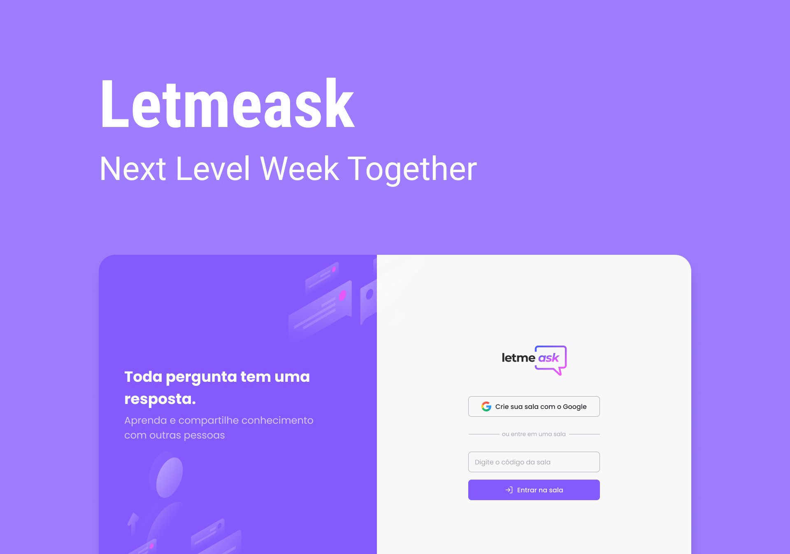

# Projeto

O Letmeask é um app para criação de salas de Q&A destinadas a um público 
como o de uma apresentação ao vivo.

# Tecnologias utilizadas

- [React](https://reactjs.org)
- [TypeScript](https://www.typescriptlang.org)
- [Firebase](https://firebase.google.com)

---

Projeto desenvolvido durante a 6ª edição do evento Next Level Week Together da [Rocketseat](https://rocketseat.com.br/).
